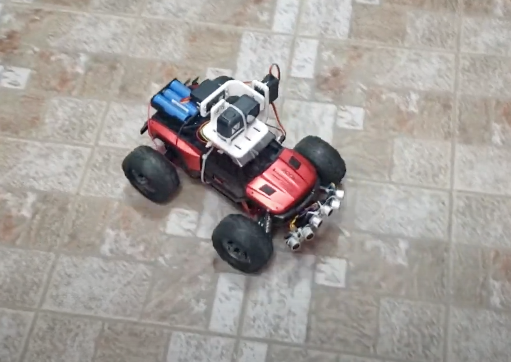

BuggyRC is a remote controlled buggy car featuring GPS, gyroscope+accelerometer, temperature and proximity sensors. This repo contains firmware for the receiver (buggy) and the transmitter (RC).

Video:
https://youtu.be/JAMrrkWYFus

